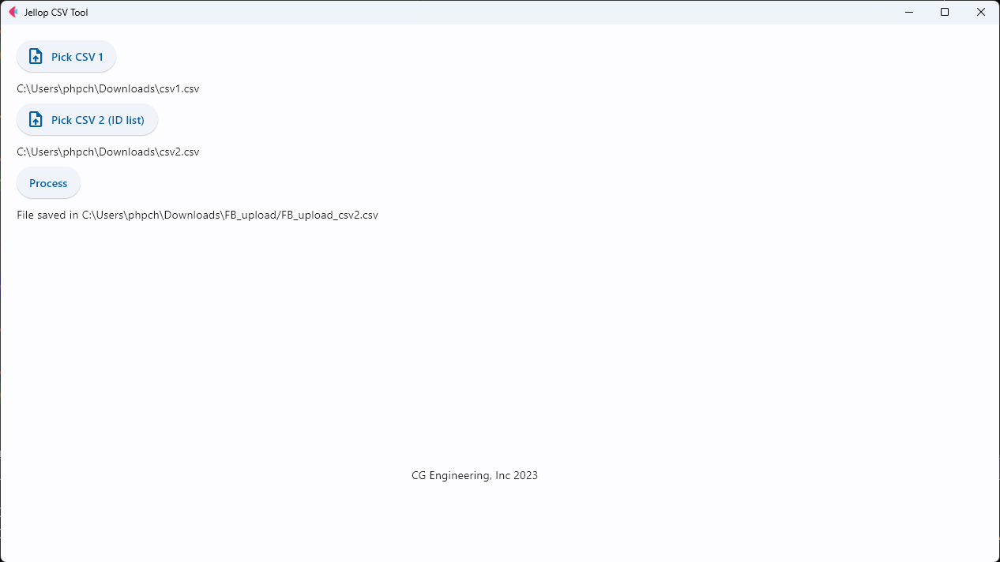

# Desktop App

## Running python app

Install python virtual env:

```shell
sudo pip install virtualenv
```

Browse to project folder.

Start virtual env and activate:

```shell
virtualenv venv
source venv/bin/activate
```

Install packages:

```shell
pip install -r requirements.txt
```

Run project:

```shell
flet run main.py -d
```

The UI will be appeared:



## Creating desktop app

```shell
flet pack main.py
```

For more details check [flet.dev docs](https://flet.dev/docs/guides/python/packaging-desktop-app)